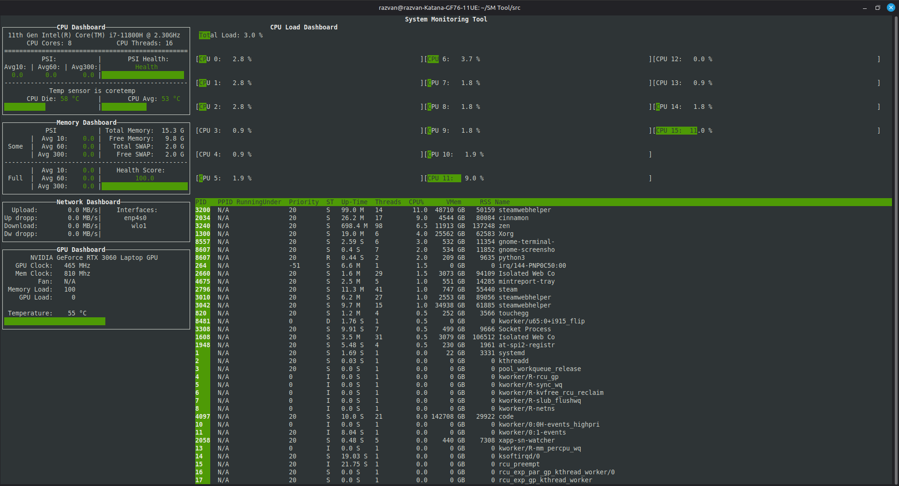

Real-time system monitoring tool written in Python with a TUI (curses-based like htop). Intended to have a simple layout and provide all the system monitoring needs a user has. Does not yet have the capability to kill/stop or search processes.

Currently implemented:
- Reads live kernel telemetry from /proc
  - CPU stats (/proc/stat):
     - Temperature
     - CPU Load (per-core and overall)
     - Fan Speed (if exposed by the motherboard)
  - Memory info (/proc/meminfo)
  - PSI pressure metrics (/proc/pressure/*)
     - For both CPU and Memory
  - Network interfaces and throughput (/proc/net/dev)
  - Current processes (/proc/pid/stat and /proc/pid/status):
     - Process information
     - Process load on CPU (htop style calculation)
- Reads Nvidia graphic card telemetry via NVML (pynvml)

To be implemented:
- I/O monitoring
- AMD graphic card monitoring
- Process management (search, kill/stop)

Current dependencies:
- pynvml
